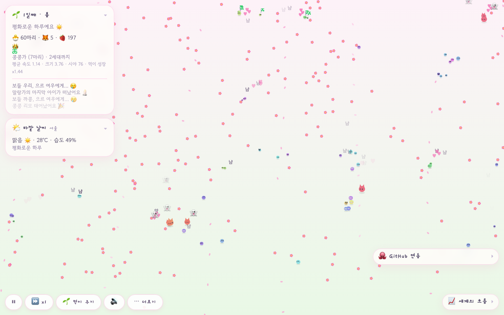

# browser-world 🌱

 



브라우저에서 돌아가는 나만의 작은 세계.
픽셀 아트 생명체들이 살고, 먹고, 번식하고, 진화하는 시뮬레이션.

**👉 https://hyeonji-1209.github.io/browser-world/** — main에 푸시하면 자동 배포

## 실행

```bash
npm i
npm run dev
```

## 데스크톱 앱으로 띄워두기

두 가지 방법:

**1. PWA (설치 없이)** — `npm run dev` 또는 배포 링크를 Chrome에서 열고 주소창 오른쪽 "설치" 아이콘 → Dock에 독립 창 앱으로 뜸.

**2. Tauri 네이티브 앱 (.app / .dmg)** — 컴퓨터 상태(CPU·RAM)를 세계의 날씨로 연동하려면 이쪽.

```bash
# Rust 필요: curl https://sh.rustup.rs -sSf | sh
npm run tauri dev      # 개발
npm run tauri build    # src-tauri/target/release/bundle/ 에 .app, .dmg 생성
```

세계가 컴퓨터를 되돌봐주기도 함 (전부 무해·옵트인):
- 🧹 **청소 조사**: 💻 카드에서 켜면 오래된 npm·pip·Xcode 캐시 뭉치가 세계에 떨어지고, 젤리들이 주워 먹으며 조사. 끝나면 "지울 수 있는 캐시 N GB" 리포트와 정리 명령어를 알려줌 — **직접 삭제는 절대 안 함**
- 🔥 **열 식히기**: CPU 70% 넘으면 앱 스스로 절전(프레임 절반). 열 범인 프로세스를 알려주고, 버튼을 누른 경우에만 확인 창을 거쳐 종료 요청(SIGTERM)

앱에서만 켜지는 규칙:
- 🔥 **열 = CPU 사용률** — 생명체가 최대 40% 빨라지지만 대사도 60% 늘어남. 화면이 붉게 물듦
- 🌫 **오염 = 메모리 압박** (RAM 60% 이상부터) — 질병 발병 확률 최대 9배, 먹이 생성 최대 60% 감소. 가장자리에 회색 안개
- 🌬 **바람 = 네트워크 트래픽** — 200KB/s부터 산들바람, 8MB/s에 강풍. 먹이가 날리고 가벼운(작은) 생명체일수록 밀려감. 미리보기 `?wind=0.8`
- 🏜 **메마름 = 디스크 여유** — 여유 25% 아래부터 땅이 마르고(갈라짐), 먹이가 최대 35% 덜 자람
- 🌙 **밤 = 배터리** — 충전 중이면 낮. 방전 중 60% 아래부터 어두워져 15%에 깊은 밤: 생명체가 35% 느려지고 잠들어 대사 40% 감소, 먹이 30% 덜 자람. 별이 뜸

세계는 5초마다, 그리고 창을 닫을 때 자동 저장됨(localStorage). 껐다 켜도 같은 세계·같은 족보가 이어지고, 창 크기가 달라지면 좌표를 맞춰줌. 🔄 새 세계 버튼이 저장을 지움.

## 스택

Vite · React · TypeScript · Tailwind v4 · Tauri 2 (Rust `sysinfo`) — 시뮬레이션 로직(`src/sim/`)은 순수 TS, React는 HUD/패널만 담당. `src-tauri/`는 데스크톱 셸.

## 현재 규칙

- 피식자는 시야 안 가장 가까운 먹이로 이동, 없으면 랜덤 배회. 시야 70% 안에 포식자가 들어오면 도망
- 유전자: 속도 · 크기 · 시야 · 색. 크고 빠르고 시야 넓으면 대사 비용 ↑
- 에너지 120 넘으면 번식 (±12% 돌연변이). 자식은 부모의 가문(성씨)을 물려받음
- 포식자 🦊: 피식자를 사냥, 자기보다 큰 먹이는 못 잡음
- 계절: 3000틱 주기, 먹이 생성량 봄 1.3 / 여름 1.0 / 가을 0.8 / 겨울 0.3
- 질병: 무작위 발병 → 접촉 전파 → 회복하면 면역
- 바깥 날씨 (Open-Meteo, 키 불필요, 위치 허용 안 하면 서울): 비 오면 먹이 최대 2.5배 + 물웅덩이, 눈, 구름, 천둥번개 ⚡, 30°C 이상·5°C 이하면 지쳐서 대사 ↑, 실제 밤이면 잠. 미리보기 `?wx=95&temp=35&night=1`
- 표정: 배고프면 울상, 도망칠 땐 땀 흘리며 놀란 눈, 먹으면 ^^ + "냠", 밤엔 눈 감고 z. 태어나면 ♥♥♥, 죽으면 👻가 떠오름
- GitHub 연동: 최근 24시간·7일 push 수로 먹이 생성 배율(0.6~2.0) 조절, 접속 시 오늘 커밋 ×10 먹이 비. `?gh=사용자명`으로 변경
- 아기는 작게 태어나 600틱에 걸쳐 어른 크기로 자람. 먹이는 계절 따라 꽃(봄)·열매(여름)·버섯(가을)·얼음열매(겨울)
- 아기는 어릴 땐(400틱) 부모를 졸졸 따라다님
- 📖 역사책: 명예의 전당(최장수·최다 자식·최다 쓰담)과 사라진 가문들의 기록
- 🎁 세계 선물하기: 세계를 JSON 파일로 내보내 친구에게 — 친구는 웹/앱 어디서든 불러와 이어 키움. 불러오기 전 세계는 타임머신에 자동 보관
- 🛡 가문 문장: 가문 이름에서 자동 생성되는 5×5 대칭 픽셀 문장 (패널·역사책·HUD)
- 💬 혼잣말: 가끔 한 마리가 속마음을 말풍선으로 — 배고프면 "배고파…", 쫓기면 "으악!", 아기는 "엄마 어딨지?"
- 📜 연간 연대기: 1년(4계절, 12,000틱)이 끝나면 그 해의 탄생·죽음(사인별)·올해의 가문·진화 변화를 카드로 정리
- 계절 축제: 계절이 바뀌는 순간 벚꽃🌸/반딧불이✨/낙엽🍂/첫눈❄️이 한바탕 (미리보기 `?festival=봄`)
- 마일스톤 축하: 100·500·1,000번째 탄생, 10·25·50세대 달성 때 색종이 🎊
- 번성한 가문(8마리 이상 최대 가문) 아이들 머리 위에 가문 문장 깃발
- 🔊 효과음: 먹으면 뽁, 태어나면 챠랑, 쓰담으면 뾰로롱, 번개 우르릉 (WebAudio 합성, 파일 없음, 토글 가능)
- ⏪ 타임머신: 3,000틱마다 자동 스냅샷(최근 8개, 메모리) — 과거의 세계로 돌아갈 수 있음
- 오래 자리를 비웠다 돌아오면 브리핑 카드 — 원하면 다녀온 만큼 세월을 빨리 감기 ⏩
- 손글씨 느낌 글꼴(Gowun Dodum·Gaegu), 보조 카드는 처음엔 접혀 있음, 버튼은 핵심 4개 + ⋯ 더보기 메뉴
- HUD가 사람 말로: "29일째 · 봄 · 평화로운 하루예요 ☀️" — 세계 상황에 따라 기분 한 줄이 바뀜. 위기가 오면 세계가 먼저 도움을 청함
- 마우스를 올리면 이름표가 뜨고, 모든 카드는 제목을 눌러 접을 수 있음(기억됨)
- 소식 피드: 탄생 🎉, 포식 😢, 질병 🤒, 가문 멸종 🕯 소식이 이름과 함께 흐름. 처음 오면 웰컴 카드가 인사
- 꾹 누르고 있으면 쓰다듬기 ♡ — 행복해하며 에너지 소량 회복 (번식 문턱은 못 넘음), 쓰담 횟수가 기록됨
- 📸 오늘의 세계: 스냅샷+스탯 요약 카드를 PNG로 저장 (앱은 데스크톱에, 브라우저는 다운로드)
- 클릭하면 스탯 + 족보(죽은 조상은 † 사망 원인). HUD에 가문 순위

## 다음에 넣어볼 것

- 핸드폰 활동 연동 (걸음수 → 먹이, iOS 단축어 → Cloudflare Worker KV)
- 세대 타임라인 되감기

## 기여

토이 프로젝트지만 이슈·PR 환영해요. 규칙 하나 넣고 → 어떻게 되나 구경 → 재밌으면 머지, 그게 전부입니다.
시뮬 로직은 React 없이 `npx vite-node`로 헤드리스 실행할 수 있어서 균형 실험하기 좋아요.

## 라이선스

[MIT](LICENSE) — 마음껏 가져다 쓰고, 여러분만의 세계를 만들어 주세요.
